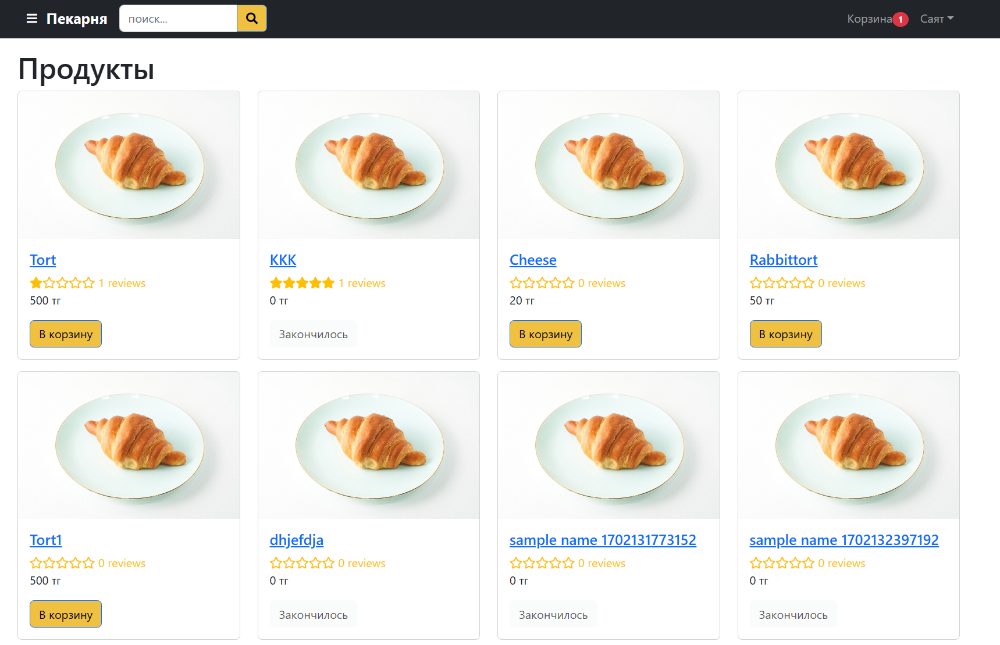
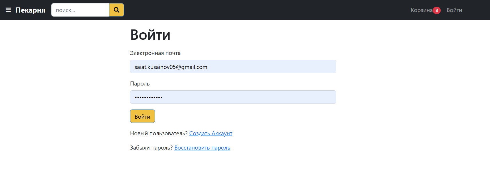
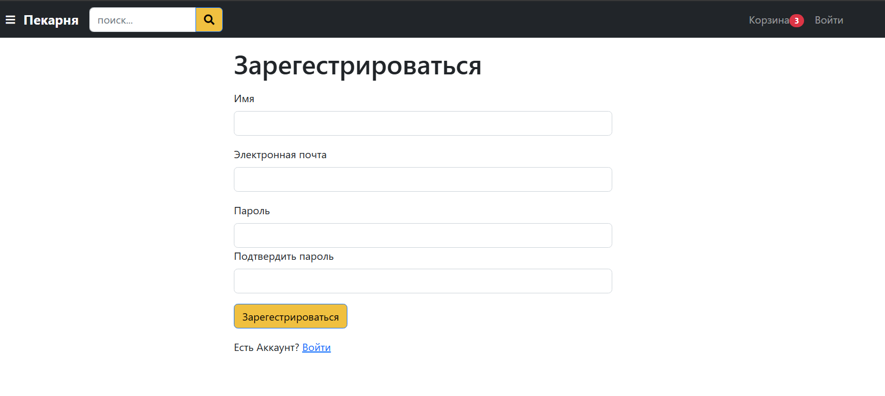
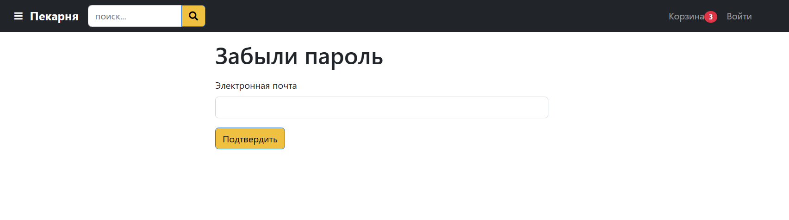
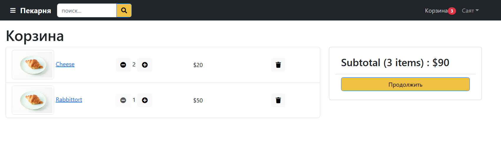
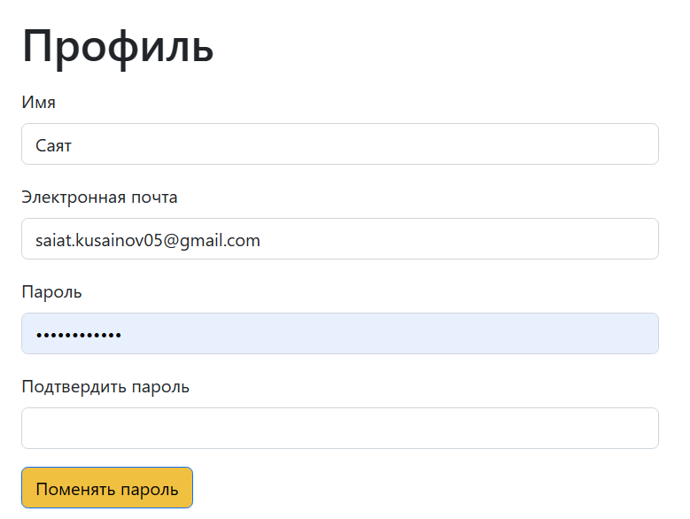
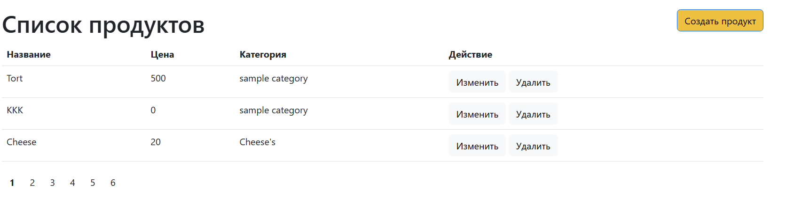
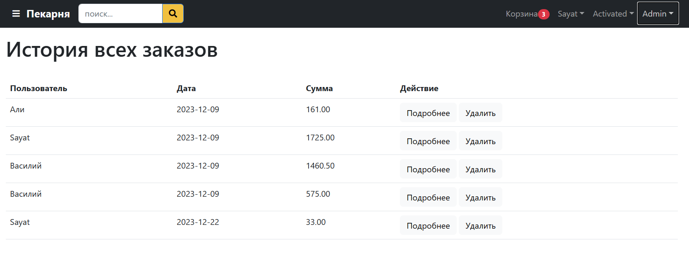
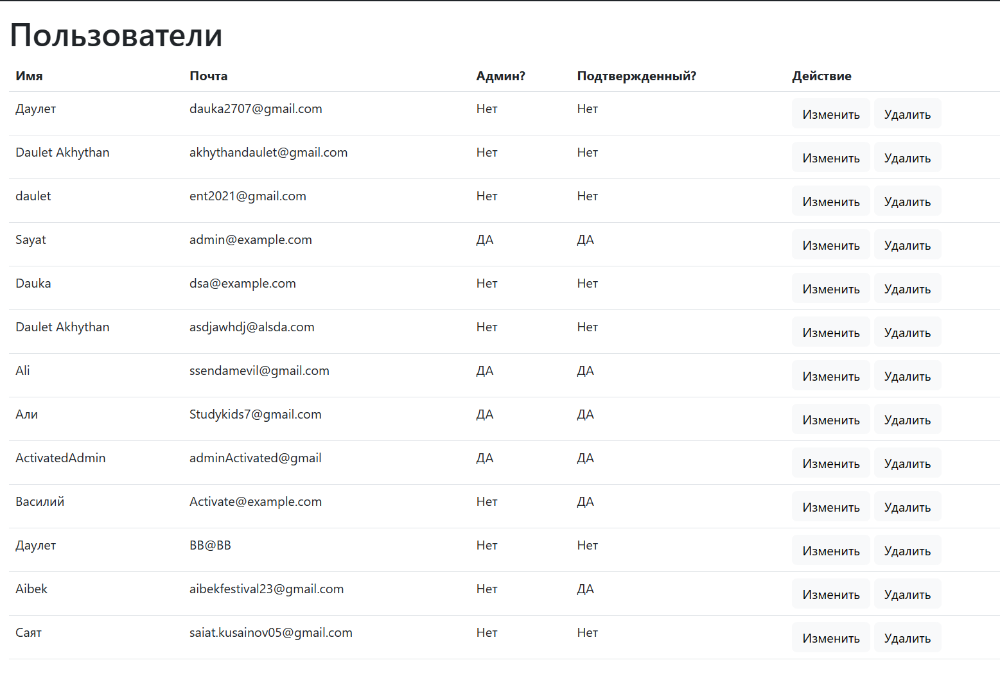

# BAKERY SHOP



# Bakery shop


## Link

-  Render : [https://ruspekarnya.onrender.com/](https://ruspekarnya.onrender.com/)

## Stack

- Node & Express: Web API, Body Parser, File Upload, JWT
- HTML5 and CSS3: Semantic Elements, CSS Grid, Flexbox
- Context API: Store, Reducers, Actions
- MongoDB: Mongoose, Aggregation
- React: Components, Hooks, Router
- Development:  Git, Github,
- Deployment: Heroku

## Run Locally

### 1. Clone repo

```
$ git clone https://github.com/EsQueues/Sayats-bakery-shop
$ cd mern-amazona
```

### 2. Create .env File

- duplicate .env.example in backend folder and rename it to .env

### 3. Setup MongoDB

- Local MongoDB
  - Install it from [here](https://www.mongodb.com/try/download/community)
  - In .env file update MONGODB_URI=mongodb://localhost/amazona
- OR Atlas Cloud MongoDB
  - Create database at [https://cloud.mongodb.com](https://cloud.mongodb.com)
  - In .env file update MONGODB_URI=mongodb+srv://your-db-connection

### 4. Run 

```
$ cd backend
$ npm install
$ npm start
```


### 5. Seed Users and Products

- Run this on browser: http://localhost:5000/api/seed
- It returns admin email and password and 6 sample products

### 6. Admin Login

- Run http://localhost:3000/signin
- Email: admin@example.com 
- Password: 123456
- Enter admin email and password and click signin

  

## Application guide


### 1. Sign in / Sign up / Forget password:
Sign in:

Sign up:

Forget password:

### 2. Add product to basket and order / Edit profile / Find by sorting or searching:
Basket:

Profile:

### 3. Admin panel:
Create product:

History of orders:

Crud operations with users:



